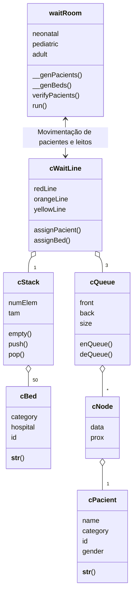

# Problema 2 - Regulação de Leitos de UTI

## Arquivos
#
### Main
* [**simulator.py**][simulator] - Interface gráfica da simulação
* [**menu.py**][menu] - Desenha a tela inicial
* [**hospital.py**][hospital] - Gerencia o funcionamento da simulação
* [**cWaitLine.py**][cWaitLine] - Controle de Pacientes e leitos
* [**cLabels.py**][cLabels] - Possui as informações contidas na interface
#
### TADs
* [**cNode.py**][cNode] - Implementa o tipo abstrado de dados Nó
* [**cStack.py**][cStack] - Implementa o tipo abstrado de dados Pilha
* [**cQueue.py**][cQueue] - Implementa o tipo abstrado de dados Fila
* [**Avaliar.py**][cPacient] - Cria o paciente com id
* [**Programa.py**][cBed] - Cria o leito médico

## Motivação para escolha dos TADs
Para o controle de pacientes, foi pensado em um tipo abstrato de dados em que o primeiro a chegar fosse o primeiro atentido. Para isso foi implementada a fila que possui a política FIFO ( First In, First Out) através do encadeamento dos nós dessa fila, logo foi utilizado lista encadeada ao invés de um vetor circular para implementar este TAD. De forma que 'enQueue()' coloca o paciente em ultimo lugar e 'deQueue()' retira o paciente em primeiro lugar. Sendo assim, além da prioridade de acordo com sua gravidade (Emergência, Muito Urgente e Urgente), aqueles que estiverem a mais tempo na fila vão receber os leitos da UTI primeiro

Para o controle de leitos, a fim de respeitar a atribuição de leitos recentemente liberados foi implementada a pilha. A fim de limitar a quantidade máxima de leitos que podem ser empilhados, visto que a quantidade de leitos vindo de cada hospital é limitada. Para isso a implementação se deu a partir do cVetor trabalhado em sala de aula, portanto a pilha implementada possui tamanho máximo, número de elemtos e duas operações de push e pop que realizam o empilhamento e a remoção do elemento do topo respectivamente.
## Classes


#
## Funcionamento 
Para montar uma interface gráfica que facilite a vizualização do que está acontecendo durante a simulaçãoFoi utilizada a biblioteca `pyglet` através do `pip install pyglet`.

Durante a primeira etapa simulação, uma frota de ambulâncias ira transportar os pacientes ao centro de regulação, sendo que a quantidade máxima de pacientes transportados por essa frota por padrão é 6 `( pode ser alterado como primeiro argumento do CMD)`, após isso será encaminhado a sala de espera q fará sua alocação a fila de espera correta de acordo com sua categoria e urgência. Então, os leitos são liberados e são enviados ao centro de regulação, o qual possui um limite de leitos que pode ser alocados, por padrão é 50 `(pode ser alterado como segundo argumento do CMD)`, depois são empilhados no sistema, de forma que os mais recentemente liberados serão alocados quando necessário.

Feito isso, na segunda etapa, é verificado o estado que o paciente se encontra, seja esse obito, melhora ou a necessidade ser alocado a uma fila com prioridade maior `(Ex: Amarela -> Laranja ou Laranja -> Vermelha)`. Logo após, é feita a checagem da disponibilidade de leitos, posteriormente o sistema remove do topo da pilha um leito e o atribui ao paciente de sua respectiva categoria que está há mais tempo na fila, portanto na primeira posição. Ao passo que a checagem e a atribuição é realizada, as informações da transferência são disponibilizadas na interface e ao finalizar todas as alocações, estes pacientes são removidos do sistema e transferidos aos leitos de UTIs dos hospitais cadastrados.

#

```mermaid
graph
  B[Leitos liberados] -->|Empilha| P[Pilha]
  A[Pacients transportados] --> S[Sala de espera]
  S -->|Emergência| R[Fila Vermelha]
  S -->|Muito Urgente| O[Fila Laranja]
  S -->|Urgente| Y[Fila Amarela]
  P -->|Desempilha| AA([Atribuição de leito ao paciente])
  F{Fila de espera} -->|Desenfileira| AA
  F -.->|Verifica os pacientes| F
  R -->|Pioridade alta| F
  O -->|Pioridade média| F
  Y -->|Pioridade baixa| F
  AA --->|Atualiza a prancheta na interface| RM(Relatório Médico)
  

  ```
  # Referências Bibliográficas:

  [1 HOLKNER, Alex. **Pyglet Documentation**. 2020. Disponível em: https://pyglet.readthedocs.io/en/latest/

  [2] Canning, J., Broder, A., Lafore, R. **Data Structures & Algorithms in Python**. Addison-Wesley. 2022.